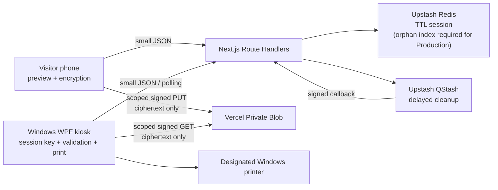

# Architecture

## System boundary

Print-cess by Paradiso is a one-document, one-copy transfer and printing system.

The phone and kiosk can be on unrelated networks. The web service coordinates a bearer-authorized
session but does not receive the plaintext, ECDH private key, or shared AES key. Route Handlers
must reject request bodies large enough to be documents and must never proxy Blob PUT or GET.

## Components

| Component              | Responsibility                                                                                                                  | Data it must not retain                                                                         |
| ---------------------- | ------------------------------------------------------------------------------------------------------------------------------- | ----------------------------------------------------------------------------------------------- |
| Mobile web flow        | Read QR fragment, select locale and one file, validate, preview, verify kiosk-key fingerprint, encrypt, direct PUT, show status | Original filename, plaintext after the active view is released, token in history/analytics/logs |
| Next.js Route Handlers | Create, claim, authorize upload, register upload, consume, report status, and verify cleanup callbacks                          | Plaintext, ciphertext body, private keys, raw token, complete signed URL in logs                |
| `SessionStore`         | TTL record, token hashes, revision, atomic state changes, consume-once                                                          | Raw tokens, filenames, document contents, private keys                                          |
| `BlobTransport`        | Exact-path signed PUT/GET/DELETE and local ciphertext equivalent                                                                | Original filename or plaintext                                                                  |
| `CleanupScheduler`     | Schedule cleanup only after upload authorization/blob risk begins                                                               | Document content, token, full signed URL                                                        |
| WPF kiosk              | Create ECDH key, show QR, consume once, download, decrypt, validate, submit once, reset                                         | Plaintext on ordinary disk, reusable session key, prior-user UI                                 |
| Printer/spooler        | Render and physically print fixed settings                                                                                      | Retention is OS/driver dependent and must be governed operationally                             |

Local development uses `MemorySessionStore`, `LocalEncryptedBlobTransport`, and
`InProcessCleanupScheduler`. Local Blob content is still the encrypted envelope; plaintext must
never be written to Downloads or Documents. External (Preview/Production) adapters are selected
per interface: the default stack is `UpstashSessionStore`, `VercelBlobTransport`, and
`QStashCleanupScheduler`, and Railway alternatives (`RailwayRedisSessionStore` or
`RailwayPostgresSessionStore`, `S3BlobTransport`, and a persistent cleanup worker) can be selected via the
`PRINT_CESS_SESSION_PROVIDER` / `PRINT_CESS_BLOB_PROVIDER` / `PRINT_CESS_CLEANUP_PROVIDER`
selectors. See `RAILWAY_PROVIDERS.md`.

The WPF composition includes a live session API client, local QR rendering, direct encrypted Blob
download, decrypt/validate, a durable print-once gate, terminal reporting/cleanup, and reset. It has
not been run on Windows or with approved server/provider resources; cross-target compilation is not
runtime evidence. Its authenticated administrator screen implements exact allow-listed installed
printer selection with an atomic persisted choice, configured-printer status, synthetic printing,
recovery acknowledgement, active-session discard, restart, audio testing, redacted observations,
explicit server/Redis/Blob/QStash status, and a bounded administrator-authenticated orphan sweep.
Server and Redis readiness are live endpoint/read checks. External Blob and QStash status is
`configured-unverified`, not a reachability claim, because the provider contract has no safe
side-effect-free probe. See `PRODUCTION_BLOCKERS.md` for runtime acceptance work.

## Session record

The persisted record is protocol version 1 and contains only:

- session ID, status, revision, creation/expiry timestamps, optional claim/completion timestamps;
- kiosk public key and SHA-256 fingerprint;
- domain-separated SHA-256 hashes of independent upload, kiosk, and claimed-phone tokens, plus
  claim/upload/consume idempotency hashes and the short consume-lease deadline;
- random encrypted Blob pathname, ETag, and ciphertext-envelope size after authorization/upload.

It contains no filename, person identifier, reservation data, plaintext, raw bearer token, or
private key. The waiting session lifetime is three minutes. A successful claim begins a
three-minute work deadline. Every signed URL is capped at the current session deadline.

After destructive cleanup, a separate receipt containing only session ID, terminal status, and
expiry may remain for 15 seconds so the phone can render the terminal result. It is not a
recoverable session and cannot authorize another operation.

Upload authorization atomically creates a separate cleanup-orphan record containing protocol
version, pseudonymous session ID, random pathname, optional committed ETag, creation time, and due
time, plus a due-time sorted-set member. It contains no token, public/private key, filename, or
document content and remains until conditional Blob deletion is finalized.

## Mobile flow

1. The kiosk registers a fresh key and session. The server returns a session ID and independent raw
   tokens once; Redis receives only their hashes.
2. The kiosk displays
   `https://<public-base-url>/s/<sessionId>#t=<uploadToken>&fp=<fingerprint>`. Fragments do not
   enter normal HTTP request lines; the page must remove sensitive fragment material from visible
   browser state after reading it.
3. The phone loads the public page, obtains the kiosk public key, hashes its raw 65-byte SEC1
   encoding, and timing-safely compares it with `fp`. Missing or mismatched fragments stop the flow.
4. Claim is an atomic compare-and-set from `waiting`. A second phone receives a neutral used-session
   result and cannot advance.
5. The visitor selects and previews one supported file. Mobile validation is an early usability
   check, not the security boundary.
6. After approval, the phone generates an ephemeral key and encrypts locally. The server returns a
   short-lived exact-path PUT URL only after an atomic `upload_authorized` transition and schedules
   cleanup at this point.
7. The phone PUTs `application/octet-stream` directly to Private Blob. It then registers the exact
   expected ciphertext size through a small JSON request. The server reads the provider-authoritative
   ETag and size; the original filename is never sent.
8. The phone polls a redacted public status view until terminal or expired.

## Kiosk flow

1. On startup and after every terminal screen, clear UI state and references, clean the app-owned
   temp directory, and generate a new session-specific ECDH key pair.
2. Render the credential-bearing QR locally (never through a QR service), replace an expired
   waiting QR automatically, and hide it immediately after claim.
3. Poll with the independent kiosk token. Atomically consume `uploaded -> consumed` before any
   download or print work.
4. Receive an exact-path, GET-only, short-lived Private Blob URL and download directly into a
   bounded ciphertext buffer. Verify size, then authenticate the envelope during AES-GCM decryption.
5. Parse the envelope, derive the key, authenticate/decrypt in memory, then validate magic bytes,
   actual type, length, PDF structure/page count/encryption/actions, or image decode/dimensions.
6. Check the configured printer and its capabilities. Submit exactly once with A4, one copy,
   one-sided, black-and-white, fit-to-page settings and no print dialog.
7. Transition `consumed -> validating -> printing -> completed`. If it is uncertain whether a job
   entered the spooler, transition to `failed` and do not auto-retry.
8. Run cleanup, best-effort clear sensitive buffers/references, show completion and an audible cue,
   then return to a fresh QR after 15 seconds.

## State machine

All transitions below are allowed; every unlisted transition is rejected. Transition and revision
checks occur atomically. Terminal states cannot be reactivated.

| Current state       | Allowed next states                                   | Entry/exit rule                                                                                |
| ------------------- | ----------------------------------------------------- | ---------------------------------------------------------------------------------------------- |
| `waiting`           | `claimed`, `expired`, `cancelled`                     | Only the first valid upload token may claim.                                                   |
| `claimed`           | `upload_authorized`, `expired`, `cancelled`, `failed` | Claim owns the session; a second phone is rejected.                                            |
| `upload_authorized` | `uploading`, `expired`, `cancelled`, `failed`         | One random pathname is reserved and cleanup is scheduled.                                      |
| `uploading`         | `uploaded`, `expired`, `cancelled`, `failed`          | Optional progress state; no second object/path may be authorized.                              |
| `uploaded`          | `consumed`, `expired`, `cancelled`, `failed`          | ETag and bounded envelope size are committed.                                                  |
| `consumed`          | `validating`, `failed`, `expired`                     | Consume succeeds once with the kiosk token; an abandoned lease may expire.                     |
| `validating`        | `printing`, `failed`                                  | Authenticated decryption precedes file validation; validation precedes print.                  |
| `printing`          | `completed`, `failed`                                 | Enter once. An ambiguous submission fails closed without retry.                                |
| `completed`         | none                                                  | Terminal; immediate cleanup and a bounded completion screen (60 seconds in the browser kiosk). |
| `failed`            | none                                                  | Terminal; cleanup, neutral error code, no internal details.                                    |
| `expired`           | none                                                  | Terminal; cleanup and fresh kiosk key/session.                                                 |
| `cancelled`         | none                                                  | Terminal; cleanup and fresh kiosk key/session.                                                 |

Cancellation is not permitted after consume. An abandoned `consumed` lease may expire before
validation starts; once validation starts, processing reaches `printing` or fails closed.

## Atomicity and idempotency

- Tokens are random and independent. Redis stores SHA-256 hashes domain-separated by credential
  role and compares decoded fixed-length values without early exit.
- Every mutating request carries the expected state/revision or is implemented as a Lua script that
  checks both before writing.
- Upload authorization is once per session and binds one random pathname. PUT is no-overwrite.
- Upload completion accepts the expected pathname implicitly from Redis, compares the client-reported
  size with provider metadata, records the provider-authoritative ETag/size, and
  cannot replace them.
- Consume changes state before returning the GET URL. A repeated consume returns conflict and never
  creates a second print opportunity.
- The print engine keeps a per-session idempotency gate. A process restart does not resume or
  resubmit a consumed/printing job.
- Cleanup is idempotent and safe when the object or session is already absent.

## Blob and cleanup flow

The implemented pathname is random, `v1/<16-byte-base64url>.bin`. It contains neither session ID
nor original filename and provides 128 bits of pathname entropy. `@vercel/blob` 2.6.1 is used as
follows:

- PUT: `issueSignedToken` and `presignUrl` are both scoped to the exact pathname and `put` only;
  `application/octet-stream`, maximum envelope size, no random suffix, and no overwrite are set.
- GET: a new exact-path `get`-only URL is issued only after consume; cache bypass is requested.
- DELETE: cleanup issues an exact-path `delete`-only URL with `ifMatch` when an ETag exists.
- Delegation and URL `validUntil` are no later than the session expiry and use the shortest
  practical operational timeout.

Production cleanup must be a convergent saga:

1. Verify the QStash signature when invoked by QStash.
2. Atomically seal an active session terminal, or observe that it is already terminal/absent.
3. Delete the expected Blob conditionally by ETag. A not-found result is success.
4. Remove the session only if its revision/path/ETag still match the sealed record.
5. Remove the orphan-ledger entry. Return success for repeated delivery.

Normal completion/failure runs cleanup immediately. A delayed QStash message, Redis TTL, kiosk
startup cleanup, and a bounded orphan sorted-set sweep cover different failure modes. Redis TTL
alone is never treated as Blob deletion. Authorization retries reattempt delayed scheduling with a
deterministic session/due-time QStash deduplication ID, closing the failed-ack window without
creating multiple messages for the same deadline. Successful kiosk registration also starts a
best-effort background sweep of at most three due records; the authenticated endpoint can sweep up
to 100.

The server implementation uses a 30-second consume lease, extends the processing lease during
validation/printing, atomically seals expired active state, retains a pathname/ETag orphan record
through delete failure, and removes the session/orphan/sorted-set entry only after conditional Blob
delete succeeds. Terminal receipts remain for 15 seconds. Local race/failure tests exercise this
flow; approved Upstash, Blob, and QStash behavior is still unverified.

## Failure behavior

- Authentication, claim, state, schema, size, or fingerprint errors fail before upload.
- GCM authentication failure fails before file parsing and printing.
- Parser/decoder failure fails before printing.
- All terminal paths request deletion. A failed delete retains the redacted pathname/ETag orphan
  entry for per-session retry or a bounded authenticated sweep.
- User screens show one next action and no stack trace, path, provider body, token, or signed URL.
- Printer state errors map to stable runbook codes. Staff never log in to the visitor's account,
  search the visitor's phone, or type a password for them.

## Trust boundaries

The HTTPS provider and server coordinate availability and can replace web JavaScript, so encryption
does not protect against a malicious deployed frontend. The kiosk operating system, application
binary, parser/renderer, printer driver, spooler, and physical output are trusted processing
components. These boundaries and residual risks are explicit in `THREAT_MODEL.md`.
