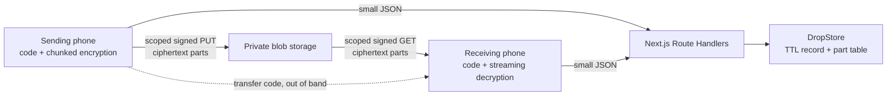

# File transfer (hand-off)

Print-cess prints one document for one visitor. The hand-off feature answers a different need: two
people standing near each other who want to move photos or files from one phone to the other,
without an app, an account, or a shared network. It reuses this repository's storage and cleanup
machinery and shares nothing with the print session state machine.

Entry points are `/send` and `/receive`. No kiosk, printer, or QR from the big screen is involved.

---

## Shape of a transfer

The transfer code normally travels between two people through a QR code or shared link that carries
it in the URL fragment. On those paths it never reaches the service, and the service is never able
to read a file it stores. The optional nearby two-digits-and-shape path below makes a narrower,
explicit convenience trade-off.

Scanning is the primary path on the receiving side: `/receive` opens the camera and reads the
sending phone's QR through `BarcodeDetector`, so nobody types twelve characters unless their browser
cannot scan or refuses the camera. The keypad is the fallback, and it reads a code through the same
parser the scanner uses — `parseDropCode` in `apps/web/src/lib/drop-link.ts` — so a whole receive
link pasted into the field opens the transfer immediately, exactly as scanning it would. Anything
that is not a code is refused rather than assembled out of the characters of a hostname.

---

## The transfer code

A code is twelve characters of Crockford base32 (`0-9`, `A-Z` without `I`, `L`, `O`, `U`), shown as
`ABCD-EFGH-JKMN`. That is sixty bits, generated on the sending phone from `crypto.getRandomValues`.
The four omitted letters are folded onto the digits they resemble when a code is normalized, so a
misread still resolves to the code on the other screen.

The sending phone stretches the code with PBKDF2-SHA256 (310,000 iterations, fixed domain salt) into
384 bits, split into:

| Output          | Bytes | Purpose                                                        |
| --------------- | ----- | -------------------------------------------------------------- |
| Drop identifier | 16    | Sent to the service; names the record and the ciphertext parts |
| Root key        | 32    | HKDF root for the manifest key and one content key per file    |

The service therefore holds an opaque identifier and ciphertext. It never sees the code, the root
key, or a file name.

### Why sixty bits is enough here

The identifier is itself derived from the code, so an attacker cannot enumerate transfers: guessing
requires a full sixty-bit guess submitted to a rate-limited endpoint, and a wrong guess almost
always names a record that does not exist. `POST /api/drops/:dropId/open` is limited per caller and
per identifier, and transfers expire in minutes.

The PBKDF2 work factor is what protects ciphertext that leaks by another route — a storage
misconfiguration, say. It lifts an offline search by roughly nineteen bits. This is a deliberate
trade against a code a person can read out loud; it is weaker than the print flow's ECDH exchange,
and the two are not interchangeable.

### Optional nearby pairing

People standing together can avoid scanning or typing the full transfer code. The sender chooses
one of four shapes and receives two digits. After the upload finishes, the receiver enters both.
For this path only, the service temporarily escrows the transfer code, shape, and digits for three
minutes. A redemption atomically deletes the record before checking the shape, so a wrong shape
uses the only attempt and an attacker cannot walk all four choices against a live code. Repeated
misses are also limited per source address.

This optional path is not server-blind: an operator with access to the live pairing store could
recover the transfer code during that short window. QR and shared-link delivery remain the private
default when that trust trade-off is not acceptable. Redis applies an actual key expiry;
PostgreSQL rejects expired records and prunes them on subsequent pairing traffic.

---

## Chunking and authentication

Files are split into 8 MiB plaintext chunks. Each chunk is one stored part, encrypted with
AES-256-GCM.

- One content key per file, derived as `HKDF(rootKey, salt = dropId, info = "…:drop:file:<i>")`.
  A per-file key means the chunk counter alone keeps every IV unique.
- The IV is the chunk index, big-endian, in the last four bytes of twelve.
- Additional authenticated data binds each chunk to its transfer, file index, chunk index, chunk
  count, and flat part index. A chunk that is reordered, moved between files, replayed into another
  transfer, or cut from the end of a file fails authentication rather than decrypting into a
  plausible but wrong result.
- An empty file is carried rather than refused. AES-GCM over empty plaintext produces the
  authentication tag alone, which is a complete, authenticated, correctly sized part bound to its
  position by exactly the same additional data; nothing about the security argument changes.

The file list travels as a separately encrypted manifest stored beside the record rather than as a
blob, so opening a transfer costs one request and reveals nothing until the code decrypts it. File
names are budgeted in UTF-8 bytes rather than characters, which is what keeps twenty Korean or
emoji names inside the manifest's 16 KiB ceiling by construction; the sending phone measures the
sealed manifest before creating anything and refuses with a sentence about the names.

Ceilings: 20 files, 4096 parts, and `DROP_MAX_TOTAL_MB` (default 2048) per transfer. The size
ceiling is measured in bytes: `GET /api/drops/capabilities` publishes it so the phone can refuse a
selection before key stretching, the create request declares its plaintext size, the schema pins the
part count between the bounds that size can legitimately need, and every commit is checked against
the declared size plus one tag per part using sizes read back from the storage provider.

The hand-off is deliberately format-blind, which is what makes it safe for Hancom documents: a
`.hwp` or `.hwpx` moves as bytes with its name intact, including Korean names and the empty MIME
type most phones report for them. `test/integration/drop-compatibility.test.ts` carries roughly
seventy-five synthetic samples across every format group through the real routes and compares
SHA-256 digests; `test/e2e/hancom-handoff.spec.ts` repeats the Hancom pair through two real
browsers. See `FILE_COMPATIBILITY.md`.

---

## Moving bytes reliably

Neither phone ever holds more than one chunk in memory.

- **Sending** reads each chunk with `File.slice()`, encrypts it, and uploads it to a scoped signed
  URL. Parts are authorized in batches of eight and transferred three at a time.
- **Receiving** streams each decrypted chunk into a destination chosen during the tap that asked for
  it: a file or a folder the visitor picked where the browser offers one, otherwise the private
  origin file system and then the browser's download machinery, otherwise memory. The screen reports
  what that destination could actually confirm — a written file is `Saved`, a started download says
  so — and each file in a transfer carries its own state, so a failure on one is not a failure of
  the rest. Without staging, a file over 512 MiB is refused before it starts rather than crashing
  the tab. See `adr/0001-save-destinations.md`.
- **Interruptions** are expected. A part upload that fails is retried with backoff, and a signed URL
  that expired mid-retry is reissued. Part authorization deliberately allows overwrite, which is why
  `BlobTransport.authorizeUpload` takes an explicit `allowOverwrite` option — a print upload is
  single-use and must never carry it.
- **Commits are checked.** `POST /api/drops/:dropId/parts/complete` reads each part's real size back
  from the storage provider instead of trusting the request, so a truncated upload fails on the
  sending side rather than much later on the receiving one.
- **The screen is held awake** for the length of a transfer. A phone that sleeps mid-upload
  throttles its timers and can stall a large hand-off, which a visitor experiences as the service
  quietly failing.
- **Time remaining is estimated** from throughput over the last twenty seconds, rounded to whole
  minutes, and withheld entirely when the transfer has stalled or the answer would exceed an hour.
  A number nobody would act on is worse than no number.

A transfer opens for reading only after every part is committed and the sender seals it. A receiver
who arrives before then — the ordinary case for a large hand-off, because the code is shown as soon
as the service holds the record rather than when the last byte lands — is told the transfer is still
being prepared and waits, with a backing-off poll. That answer carries no file list, no progress,
and nothing about who is sending; somebody guessing a code still gets the same `404` as before.

---

## Retention and erasure

A transfer lives for `DROP_TTL_SECONDS` (default 1800, accepted range 300–86400) and is then swept
along with orphaned print ciphertext by the same scheduled `/api/cleanup` sweep. Part paths are
derived from the identifier rather than stored, so a record written before a crash still names all
of its ciphertext.

The sender can erase a transfer immediately from the ready screen; `DELETE /api/drops/:dropId`
deletes every part and the record.

The sending screen reports how far the receiving side has got, in the only four steps the service
can honestly distinguish: waiting, opened, downloading, delivered. `opened` is an open request,
`downloading` is a receiver asking for the first chunk, and `delivered` is a one-bit receipt the
receiving flow posts to `POST /api/drops/:dropId/receipt` once it has finished handling every file.
The receipt carries no identity, no file name, no destination app, and no device; it is
unauthenticated for the same reason opening and downloading are, which is that reaching it at all
required deriving the identifier from the transfer code.

---

## Storage adapters

`DropStore` is deliberately separate from `SessionStore`. A transfer has no kiosk, no printer, and
many parts, so folding it into the print session state machine would weaken both.

| Provider selector         | Implementation                                  |
| ------------------------- | ----------------------------------------------- |
| local development         | `MemoryDropStore`                               |
| `upstash-redis` (default) | `RedisDropStore` over `UpstashScriptClient`     |
| `railway-redis`           | `RedisDropStore` over the standard Redis client |
| `railway-postgres`        | `RailwayPostgresDropStore`                      |

Both hosted Redis providers reach one implementation through the `RedisScriptClient` port, so the
atomic contract — a create that never overwrites, revision-checked updates — is identical on each.
The shared state rules live in `apps/web/src/server/drop-store/transitions.ts` so the three adapters
cannot drift into three definitions of "sealed" or "already committed".

---

## What is deliberately not built

- **No sender presence requirement.** The sending phone can close its page once a transfer is
  sealed. That rules out an interactive key exchange, which is why the code carries the key.
- **No transfer history, receipts, or naming.** The service stores no record of who sent what.
- **No resumable receive across page loads.** A reload restarts the download; the parts are still
  there, so nothing is lost but time. Resuming would mean persisting the transfer code, or keys
  derived from it, somewhere a later page load could read — which is a durable copy of the only
  secret in the design, in exchange for saving a repeat of a download that already works.
- **No folder transfer.** A browser can offer the files inside a folder, but preserving the
  structure means putting relative paths in the manifest and reconstructing directories on the far
  side, which is where zip-slip lives. The current policy — every path separator is replaced, so no
  name the receiver ever handles contains one — is what makes traversal impossible by construction,
  and it is worth more than the convenience. A folder can be sent today by archiving it first.
- **No automatic archive of a whole transfer.** It would add a compression dependency, assemble the
  whole transfer somewhere before anything could be downloaded, and remove the ability to take one
  file out of five. The folder picker solves the same problem better where it exists.
