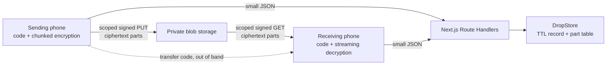

# File transfer (hand-off)

Print-cess prints one document for one visitor. The hand-off feature answers a different need: two
people standing near each other who want to move photos or files from one phone to the other,
without an app, an account, or a shared network. It reuses this repository's storage and cleanup
machinery and shares nothing with the print session state machine.

Entry points are `/send` and `/receive`. No kiosk, printer, or QR from the big screen is involved.

---

## Shape of a transfer

The transfer code travels between two people — read aloud, or scanned from a QR code that carries
it in the URL fragment. It never reaches the service, and the service is never able to read a file
it stores.

---

## The transfer code

A code is twelve characters of Crockford base32 (`0-9`, `A-Z` without `I`, `L`, `O`, `U`), shown as
`ABCD-EFGH-JKMN`. That is sixty bits, generated on the sending phone from `crypto.getRandomValues`.
The four omitted letters are folded onto the digits they resemble when a code is normalized, so a
misread still resolves to the code on the other screen.

The sending phone stretches the code with PBKDF2-SHA256 (310,000 iterations, fixed domain salt) into
384 bits, split into:

| Output          | Bytes | Purpose                                                        |
| --------------- | ----- | -------------------------------------------------------------- |
| Drop identifier | 16    | Sent to the service; names the record and the ciphertext parts |
| Root key        | 32    | HKDF root for the manifest key and one content key per file    |

The service therefore holds an opaque identifier and ciphertext. It never sees the code, the root
key, or a file name.

### Why sixty bits is enough here

The identifier is itself derived from the code, so an attacker cannot enumerate transfers: guessing
requires a full sixty-bit guess submitted to a rate-limited endpoint, and a wrong guess almost
always names a record that does not exist. `POST /api/drops/:dropId/open` is limited per caller and
per identifier, and transfers expire in minutes.

The PBKDF2 work factor is what protects ciphertext that leaks by another route — a storage
misconfiguration, say. It lifts an offline search by roughly nineteen bits. This is a deliberate
trade against a code a person can read out loud; it is weaker than the print flow's ECDH exchange,
and the two are not interchangeable.

---

## Chunking and authentication

Files are split into 8 MiB plaintext chunks. Each chunk is one stored part, encrypted with
AES-256-GCM.

- One content key per file, derived as `HKDF(rootKey, salt = dropId, info = "…:drop:file:<i>")`.
  A per-file key means the chunk counter alone keeps every IV unique.
- The IV is the chunk index, big-endian, in the last four bytes of twelve.
- Additional authenticated data binds each chunk to its transfer, file index, chunk index, chunk
  count, and flat part index. A chunk that is reordered, moved between files, replayed into another
  transfer, or cut from the end of a file fails authentication rather than decrypting into a
  plausible but wrong result.

The file list travels as a separately encrypted manifest stored beside the record rather than as a
blob, so opening a transfer costs one request and reveals nothing until the code decrypts it.

Ceilings: 20 files, 4096 parts, and `DROP_MAX_TOTAL_MB` (default 2048) per transfer.

---

## Moving bytes reliably

Neither phone ever holds more than one chunk in memory.

- **Sending** reads each chunk with `File.slice()`, encrypts it, and uploads it to a scoped signed
  URL. Parts are authorized in batches of eight and transferred three at a time.
- **Receiving** streams each decrypted chunk into the private origin file system where it is
  available, and only then hands the assembled file to the browser's download machinery. Browsers
  without it fall back to collecting chunks in memory, and the receiving screen says so before a
  large transfer starts.
- **Interruptions** are expected. A part upload that fails is retried with backoff, and a signed URL
  that expired mid-retry is reissued. Part authorization deliberately allows overwrite, which is why
  `BlobTransport.authorizeUpload` takes an explicit `allowOverwrite` option — a print upload is
  single-use and must never carry it.
- **Commits are checked.** `POST /api/drops/:dropId/parts/complete` reads each part's real size back
  from the storage provider instead of trusting the request, so a truncated upload fails on the
  sending side rather than much later on the receiving one.

A transfer opens for reading only after every part is committed and the sender seals it.

---

## Retention and erasure

A transfer lives for `DROP_TTL_SECONDS` (default 1800, accepted range 300–86400) and is then swept
along with orphaned print ciphertext by the same scheduled `/api/cleanup` sweep. Part paths are
derived from the identifier rather than stored, so a record written before a crash still names all
of its ciphertext.

The sender can erase a transfer immediately from the ready screen; `DELETE /api/drops/:dropId`
deletes every part and the record. The sending screen also reports whether the transfer has been
collected, which is the only thing the service knows about the receiving side.

---

## Storage adapters

`DropStore` is deliberately separate from `SessionStore`. A transfer has no kiosk, no printer, and
many parts, so folding it into the print session state machine would weaken both.

| Provider selector         | Implementation                                  |
| ------------------------- | ----------------------------------------------- |
| local development         | `MemoryDropStore`                               |
| `upstash-redis` (default) | `RedisDropStore` over `UpstashScriptClient`     |
| `railway-redis`           | `RedisDropStore` over the standard Redis client |
| `railway-postgres`        | `RailwayPostgresDropStore`                      |

Both hosted Redis providers reach one implementation through the `RedisScriptClient` port, so the
atomic contract — a create that never overwrites, revision-checked updates — is identical on each.
The shared state rules live in `apps/web/src/server/drop-store/transitions.ts` so the three adapters
cannot drift into three definitions of "sealed" or "already committed".

---

## What is deliberately not built

- **No sender presence requirement.** The sending phone can close its page once a transfer is
  sealed. That rules out an interactive key exchange, which is why the code carries the key.
- **No transfer history, receipts, or naming.** The service stores no record of who sent what.
- **No resumable receive across page loads.** A reload restarts the download; the parts are still
  there, so nothing is lost but time.
